# Installing Terraform Enterprise in demo mode and recovering it from snapshot 

In this project we will document to how install Terraform Enterprise in a Vagrant VM, make a snapshot of the installation, reinstall the replicated installer and recover it from previously generated snapshot.

## About Terraform Enterprise
Terraform Enterprise is on-prem version of Terraform Cloud. This means that it implements the functionality of Terraform Cloud in private managed and secured infrastructure with additional enterprise-grade architectural features like audit logging and SAML single sign-on.


### Prerequisites
 - Install VirtualBox:
Download and install accordingly to your OS as described here:
https://www.virtualbox.org/wiki/Downloads

 - Install Vagrant:
Download and install accordingly to your OS as described here:
https://www.vagrantup.com/downloads.html

 - This document assumes you have a license file:
```
license.file
```


### Open a terminal


 OS system | Operation
 ------------ | -------------
| Windows | Start menu -> Run and type cmd |
| Linux  |Start terminal |
| macOS | Press Command - spacebar to launch Spotlight and type "Terminal," then double-click the search result. |

### Download this repo
- clone the repo locally
```
clone git@github.com:yaroslav-007/vagrant-ptfe-demo-self-manual.git
cd vagrant-ptfe-demo-self-manual
```

- vagrant up  to create and power on the system.
 ```
 vagrant up
 ```

This is a VM with Ubuntu 18.04.3 LTS and includes the required configuration:
https://www.terraform.io/docs/enterprise/before-installing/index.html#linux-instance

### Install Replicated console
log in the new VM
```bash
vagrant ssh
```

> The documentation for the installation can be found here:  https://www.terraform.io/docs/enterprise/install/installer.html#run-the-installer-online
 
Install replicated console using:

```bash
curl https://install.terraform.io/ptfe/stable | sudo bash
```

```
Answer each question to perform the installation. Choose the IP of your system, and provide the information of y/N for proxy

- Please choose one of the following network interfaces:
```
 - 1


```
The installer was unable to automatically detect the private IP address of this machine.
Please choose one of the following network interfaces:
[0] enp0s3      10.0.2.15
[1] enp0s8      192.168.56.33 <--
```

- Service IP address: 192.168.56.33

```
Does this machine require a proxy to access the Internet? (y/N)
```
 - N


At this point the installation will start.
Once installation is complete, you wil be ask to go to the replicated console:
http://192.168.56.33:8800


### Deployment of Terraform Enterprise (former Private Terraform Enterprise)

Then we open the suggested address in web browser.
There we set the hostname as `192.168.56.33.xip.io` and click on `Use Self-Signed Cert`:

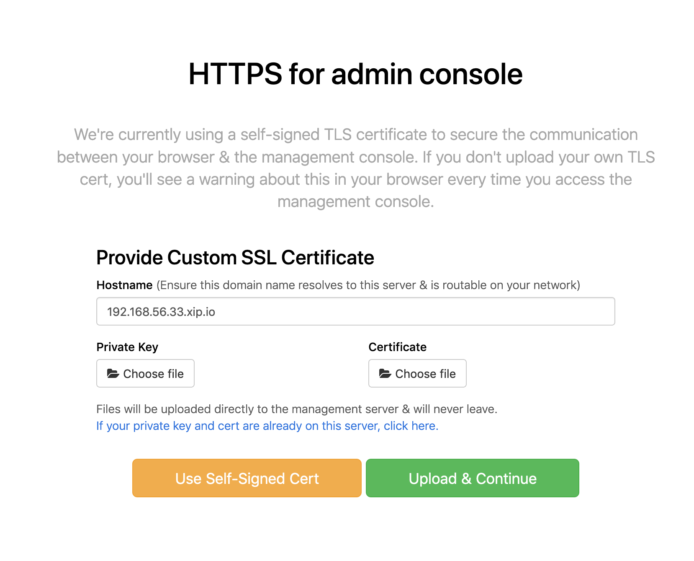

On the next screen we choose Online installation:

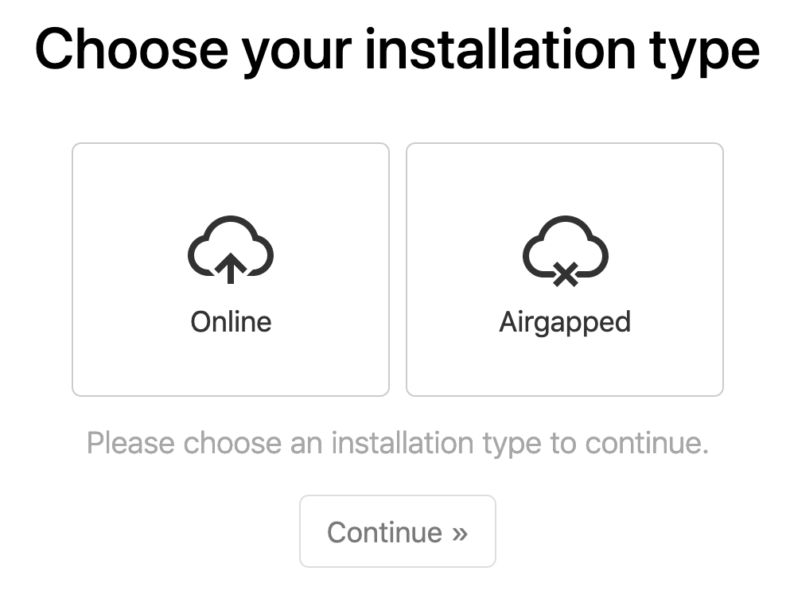

On the next page we choose how to secure Admin console. In our case we select password:

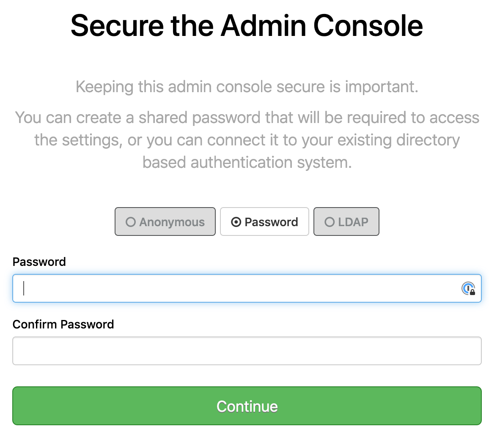

Next page run compliance tests. We expect that everything will be green so we can continue:

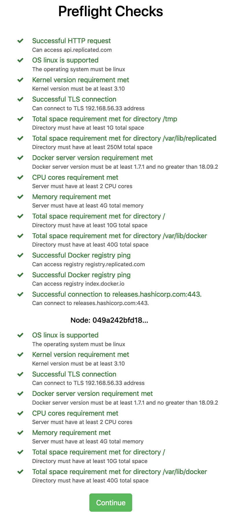

Next on is installation type. Since we will use this for testing purposes we chose demo. This means that all Terraform Enterprise data will be stored in the instance:

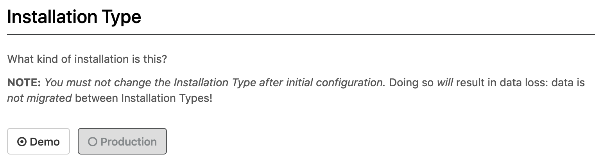

The message that settings are saved and we can start the app:

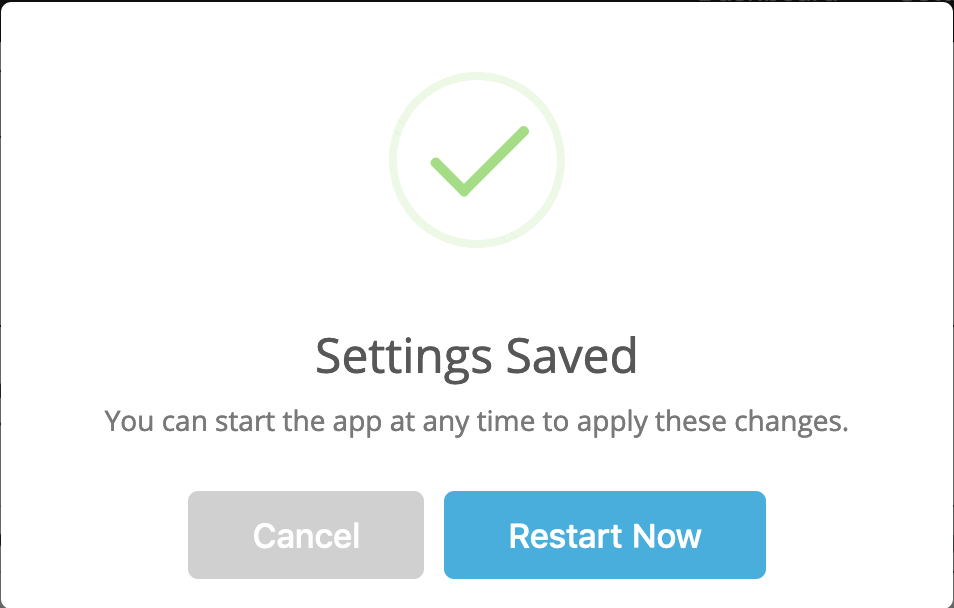

### Take initial snapshot

Then we will see screen showing that the program is starting:

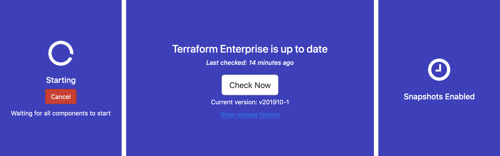

After web page states that Terraform is started, we make snapshot of the system. Since it is Demo installation, the snapshot will contain application data and installer data. On the right we can start the snapshots:

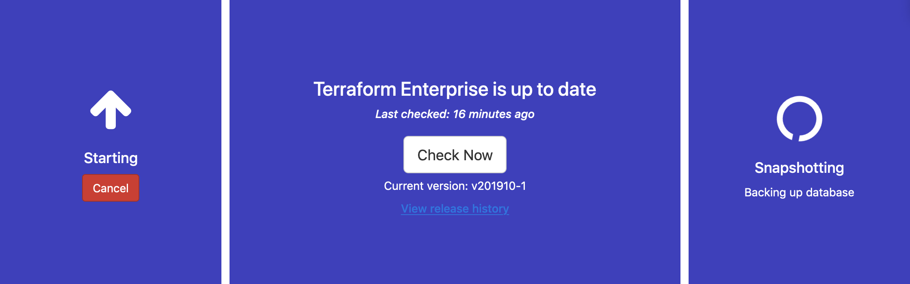

# Delete the instance to recover from snapshot

We can proceed with deleting the instance. 

- For this we log in the instance. In the local repository folder run:
```
vagrant ssh
```

- Use the script
```
cd /vagrant
sudo bash delete_all.sh
```

- Reboot the instance
```
shutdown -r 0
```

### Perform a new installation of replicated console

Perform an installation the same way we did the first time.

### Recover from snapshot
This time instead of deploying Terraform Enterprise, we will recovered it from snapshot. We run:

```bash
curl https://install.terraform.io/ptfe/stable | sudo bash
```
 and we follow the same steps as the first time. Again we open the browser as the script suggested: http://192.168.56.33:8800 and we populate the hostname `192.168.156.33.xip.io` and we choose `Use Self-Signed Cert`:


When we got to the license page where we upload our license and we proceed with restore from snapshot:

 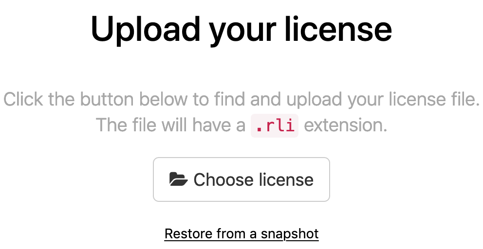

Then we have to choose a snapshot to restore from. We select local with path `/var/lib/replicated/` and choose restore:

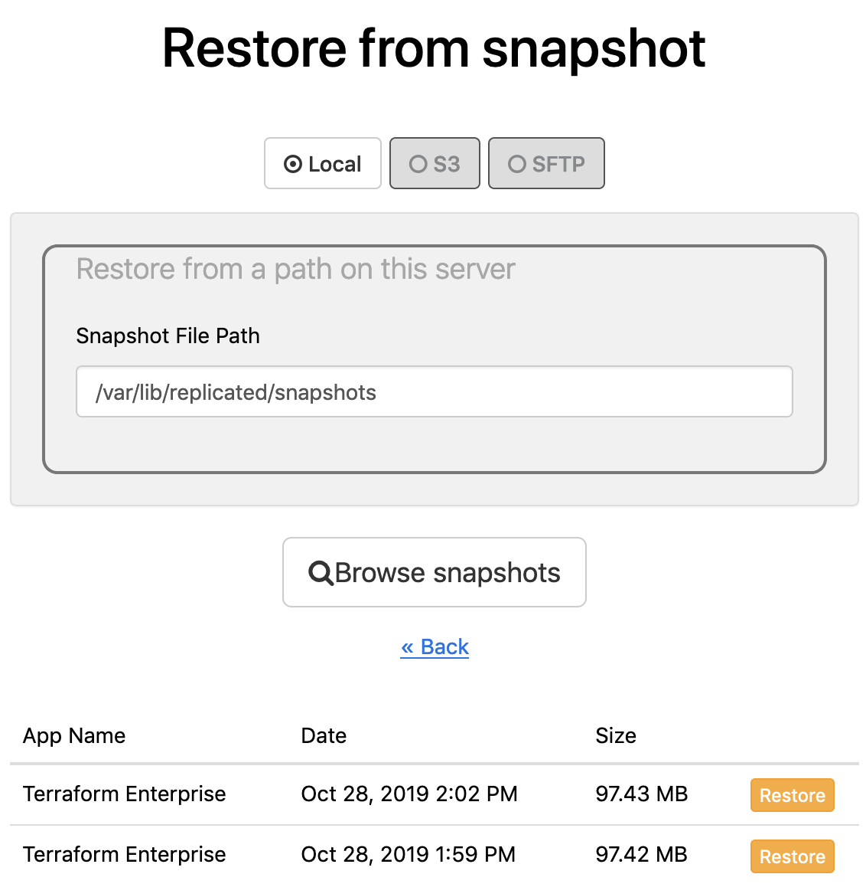

When restore is done we will be asked to populate the Admin console password:

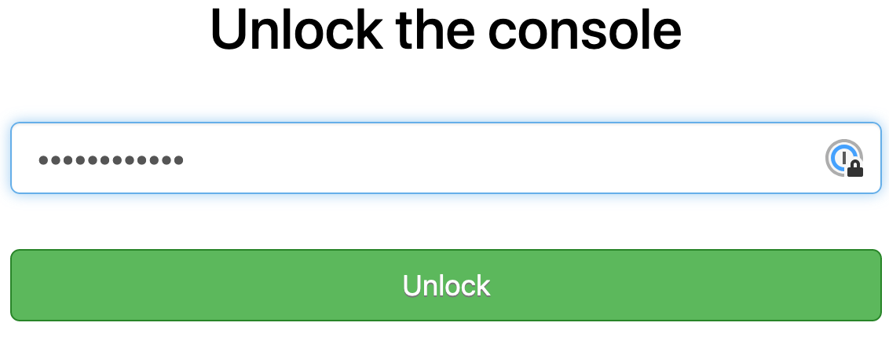

After all the checks are passed again we choose to restore cluster:

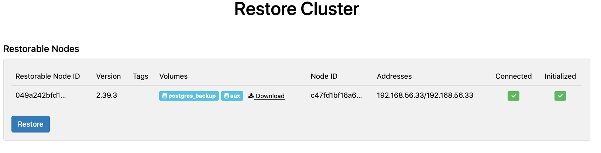

When restore is done, Terraform Enterprise is operational again.